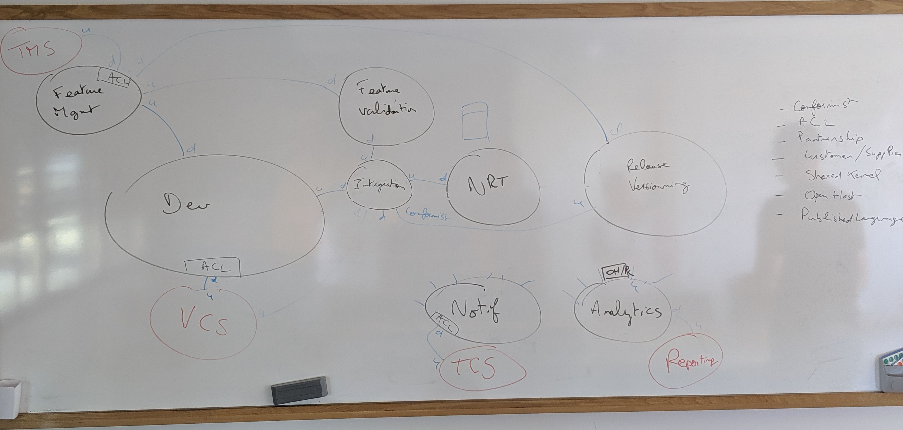

# Bounded Contexts, Ubiquitous Language and Context Map

## Bounded Contexts

Here are the main Bounded Contexts identified so far. You will find some information about their responsabilities, their ubiquitous language, and how to interact with them, either with commands you can send, queries you can make, or events you can listen to.

Before delving into them, you may first read [the quick presentation of the initiative](../../join-us.md), and have a look to [the quick feedback of our Big Picture Event Storming sessions](../event-storming/big-picture.md).

- [Feature description](feature-description.md)
- [Development](development.md)
- [Feature validation](feature-validation.md)
- [Integration](integration.md)
- [Non Regression Testing](nrt.md)
- [Versionning and deployment](versionning-deployment.md)
- [Notification](notification.md)
- [Analytics](analytics.md)

## Context Map

Here is the current version of the Context Map. It's currently a work in progres.

